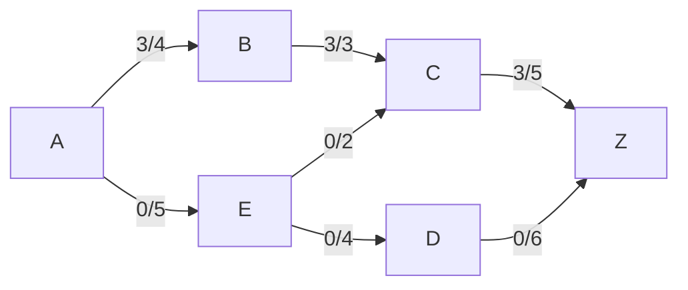

# Ford-Fulkerson Algorithm

네트워크 유량의 가장 기본적인 알고리즘 중 하나인 포드 풀커슨(Ford-Fulkerson) 알고리즘으로 시작점에서 도착점으로 얼마나 많은 유량(flow)를 보낼 수 있는 최대의 양을 구하는 알고리즘이다.

---

##### 용어정리

<b>시작점</b>(Source) : 유량이 시작되는 정점으로 이 글에서는 A로 표현하고자 한다.

**도착점**(Sink) : 유량이 도착하는 정점으로 이 글에서는 Z로 표현하고자 한다.

**용량**(Capacity) : 두 정점 사이에 최대로 흐를 수 있는 양

c(u,v) : 정점 u에서 v로 갈 수 있는 용량

**유량**(Flow) : 두 정점 사이에 실제로 흐르는 양

f(u,v) :정점 u에서 v로 흐르는 유량

**증가경로**(Augmenting path) : 시작점에서 도착점으로 유량을 보내는 경로

**잔여용량**(Residual capacity) : 현재 흐를 수 있는 유량으로 용량과 유량의 차이를 의미한다.

r(u,v) = c(u,v) - f(u,v) 로 해당 간선에 추가적으로 흘려 보낼 수 있는 유량을 의미한다.

---

#### 네트워크 유량의 특징

**1. 용량의 제한** : 아주 당연한 말이지만 어느 한 간선에 흐르는 유량은 그 간선의 용량을 넘을 수 없다. f(a,b) <= c(a,b)

**2. 유량의 대칭** : f(u,v) = -f(u,v)

**3. 유량의 보존** : 어느 한 정점을 기준으로 해당 정점에 들어오는 유량의 총 합과 나가는 유량의 총합이 같아야한다.


단순 한줄 연결을 예로 들었을 때 f(a,b)=f(b,z) 여야한다.

유량의 대칭성에 의해 어느 한 정점에서 들어오는 유량들의 합, 혹은 보내는 유량의 합은 항상 0이 되어야 한다. Σf(u,v) = 0

---

#### Ford-Fulkerson알고리즘 설명

앞서말한 네트워크 유량 문제로 얼마나 많은 양의 유량을 보낼 수 있는가 하는 방식으로 DFS(Depth First Search)[깊이우선탐색]을 사용한다.

[^DCF]: 그래프나 트리에서 존재하는 모든 노드를 탐색하는 방법 중 하나로, 한 루트에서 최대한 깊숙히 들어가서 확인 후 다시 올아와 다른 루트로 탐색을 하는 방법


```
c(a,b)=4
c(a,e)=5
c(b,c)=3
c(e,c)=2
c(e,d)=4
c(c,z)=5
c(d,z)=6
```

1. 증가경로(augmenting path)를 찾는다.
2.  찾아낸 증가경로에 해당하는 최대 유량(flow)을 흘려보낸다.

A > B > C >Z : Total 유량 3



---

A > E > C > Z : Total 유량 5


---

A > E > D > Z : Total 유량 8


java link [Ford-Fulkerson](url)

```
콘솔창
7
A B 4
A E 5
B C 3
E C 2
E D 4
C Z 5
D Z 6
```

최초에는 간선의 개수를 적는다.

그 후 두 정점과 두 정점사이의 용량을 입력한다.