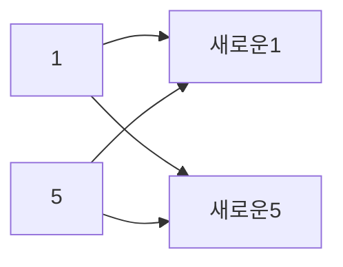

# 유전알고리즘을 이용한 회귀식 추정

### 그래프 정하기

우선 그래프를 정하는데에 있어 근래에 사람들이 가장 많이 본 것중에 나의 실력에 맞게 1차원 상승그래프를 그릴 수 있는게 무엇이 있을까 하다가, 주식이나 비트코인이 생각났다. 주식에 대해 아무것도 모르는 지인들도 한번쯤 해본적 있는 사람이 있는 것보면 사용하기에 아주 적절하다는 생각이 들었고, 나는 그 중에서도 주식을 오래보고 사는 사람들이 적금처럼 사는 삼성전자의 주식에서 사용하기로 하였다. 


상승폭이 가장 잘 보이는 2020년 4월부터 2021년 1월까지 매월 초의 가격을 이용하여 코드를 짜보고자 하였다. y축의 가격부분은 천원단위까지만 사용하며 x축의 기간은 1부터 10로 대체한다.

| 4월   | 5월   | 6월   | 7월   | 8월   | 9월   | 10월  | 11월  | 12월  | 1월   |
| ----- | ----- | ----- | ----- | ----- | ----- | ----- | ----- | ----- | ----- |
| 47000 | 48750 | 55500 | 53600 | 57500 | 55600 | 59700 | 60100 | 71500 | 88800 |

위의 값을 다음과 같이 이용한다.


| 1    | 2    | 3    | 4    | 5    | 6    | 7    | 8    | 9    | 10   |
| ---- | ---- | ---- | ---- | ---- | ---- | ---- | ---- | ---- | ---- |
| 47   | 48   | 55   | 53   | 57   | 55   | 59   | 60   | 71   | 88   |


```java
// x,y값 입력
	int [] value = new int[20];
	int max = value.length;
			for(int i=0; i<max/2;i++) {
				value[i]=i+1;
			}
			Scanner sc = new Scanner(System.in);
			System.out.println("가격을 입력하시오.");
			for(int i=max/2; i<max;i++) {
				value[i]=sc.nextInt();
```

```
입력값
47
48
55
53
57
55
59
60
71
88
```

---

식은 1차식인 y=ax+b를 사용 할 것이다. 나는 a값과 b값의 범위를 어떻게 설정할까 고민을 하다 최초의 값과 마지막값의 기울기인 a값과 그에 맞는 b값을 평균으로 잡고 상승그래프이기에 기울기의 범위는 0부터 2a, 그리고 y축 값의 범위는 -b부터 2b까지의 범위를 임의로 설정하였다.

```java
// 기울기와 y축값의 범위를 결정할 기준생성
int average_a = (value[max-1]-value[max/2])/(value[max/2-1]-value[0]);
int average_b = value[max/2]-value[0]*average_a;
```

---

다음으로는 최초의 유전자 식을 랜덤하게 8쌍을 만들었다. 1차원 배열을 통해 1~8번째 배열은 기울기인 a값을 9번째부터 16번째 배열까지는 y축값을 나타내는 b를 의미한다. 임의의 i(i<=8)번째 배열과 i+8배열이 한 쌍이 되어 하나의 식을 가진다.

```java
// 최초의 랜덤한 a,b값을 가진 식 8개 만들기
double[] candidates = new double[16];
	int c_max=candidates.length;
				
	for(int i=0; i< c_max/2;i++) {
		candidates[i]=(int)(Math.random()*average_a*2);
	}
	for(int i=c_max/2;i<c_max;i++) {
		candidates[i]=(int)(Math.random()*average_b*3)-average_b;
```

---

나는 유전자 알고리즘을 선택하는 방식에 있어 대부분 사용하는 룰렛휠방식의 코드를 짜는데 많은 어려움을 겪어 약육방식의 방법을 통해 주어진 삼성전자의 주식값과 랜덤하게 생긴 식의 값의 차이를 통해 생성된 오류의 개수를 통해 더 우월한 식이 살아남게 만들었다.

```java
//오류수					
for(int k=0; k<fit.length;k++) {
	for(int j=0;j<max/2;j++) {
		if(value[j+max/2]>(candidates[k]*value[j]+candidates[k+c_max/2])) {
			fit[k]=fit[k]+value[j+max/2]-(candidates[k]*value[j]+candidates[k+c_max/2]);
		}
		else {
			fit[k]=fit[k]+(candidates[k]*value[j]+candidates[k+c_max/2])-value[j+max/2];
		}
	}//	System.out.println("fit수"+fit[k]);
}
					
// 약육강식의 방법 사용
for(int j=0; j<c_max/2;j++) {
	int x=(int)(Math.random()*c_max/2-1);
	int y=(int)(Math.random()*c_max/2-1);
	if(fit[x]>fit[y]) {
		selcandidates[j]=candidates[y];
		selcandidates[j+c_max/2-1]=candidates[y+c_max/2-1];
	}
	else {
		selcandidates[j]=candidates[x];
		selcandidates[j+c_max/2-1]=candidates[x+c_max/2-1];
	}
}
```

---

그렇게 강한자들은 뽑은 selcandidates배열을 통해 자손을 발생시키게 되는데 이 과정에서는 1번째와 5번째, 2번째와 6번째 순으로 고정되게 자손을 발생시키는 방법을 사용하였고



이 과정에서의 자손을 어떻게 발생시킬까 하다가 임의로 이렇게 값을 줘 보았다.

```java
// 자손
for(int j=0;j<c_max/4;j++) {
	candidates[j]=(selcandidates[j]+selcandidates[j+4])/2+3;
	if((selcandidates[j]+selcandidates[j+4])/2-3>0) {
		candidates[j+4]=(selcandidates[j]+selcandidates[j+4])/2-3;
	}
	else {
		candidates[j+4]=(selcandidates[j]+selcandidates[j+4])/2+1;
	}
	candidates[j+c_max/2]=(selcandidates[j+c_max/2]+selcandidates[j+c_max/2+4])/2+3;
	candidates[j+c_max/2+4]=(selcandidates[j+c_max/2]+selcandidates[j+c_max/2+4])/2-3;
//					System.out.println("j,"+candidates[j]+",j+4,"+candidates[j+4]+",j+c_max/2,"+candidates[j+c_max/2]+",j+c_max/2+4,"+candidates[j+c_max/2+4]);
	}
```

---

그 후 돌연변이를 확률 발생시키는 코드를 짜서 코딩을 끝마쳤다. 식의 수를 8개로 했기에 돌연변이의 최초 확률은 1/8로 짜보았다.

```java
// 돌연변이
int change= (int)(Math.random()*8);
int select= (int)(Math.random()*8);
if(change==0) {
	candidates[select]=candidates[select]+3;
	candidates[select+c_max/2]=candidates[select+c_max/2]+3;
}
```

코드를 짜고 난뒤 추정된 식이 적절한지 확인을 하는 방법을 생각해내지 못했고, 그렇기에 반복문을 통해 계속 반복하여 오류수가 100회 미만인 경우를 100개정도 자료를 수집해보고자 한다. 또한 돌연변이가 무조건 하나는 발생하는 상항과 전혀 발생하지 않는 상황을 가정하고자 하였다.

우선 100개정도의 자료를 수집하였을 때 최소 오류수의 개수는 41개 검출 된 기울기 a=6.5 y축의 값은 b=26.5인 y=6.5x+26.5인 식이 나왔다.

기존의 가격그래프와 확인해본다.


돌연변이가 무조건 발생하는 경우와 발생하지 않는경우를 각각 30회 실행결과 평균 오류수치가 돌연변이가 100%발생하는 경우가 약 28개정도 적은 결과가 나왔다.

