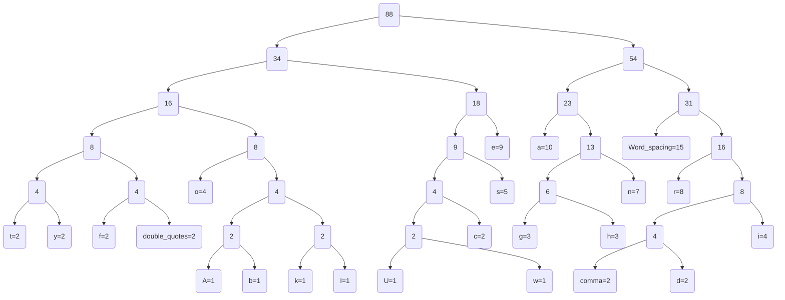
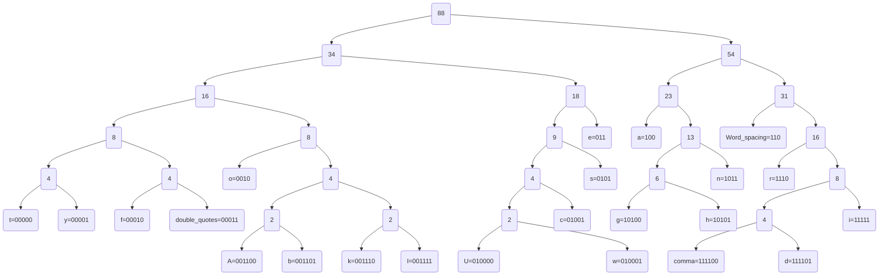

# Huffman Tree

### 텍스트 파일에 사용된 예시문 :

 "As far as Ukrainians are concerned, the war has been going on for eight years already,"


1. Java 코드를 통해 나온 결과값들을 바탕으로 각각의 문자에 대해 node를 만든다.

   빈도수 1

   ```mermaid
   graph TD
   A
   b
   k
   I
   U
   w
   
   
   
   ```

   빈도수2

   ```mermaid
   graph TD
   t
   y
   f
   double_quotes
   c
   comma
   d
   ```

   빈도수3이상

   ```mermaid
   graph TD
   g=3
   h=3
   i=4
   o=4
   s=5
   n=7
   r=8
   e=9
   a=10
   Word_spacing=15
   ```

   2. 가장 작은 빈도수를 가진 두 개의 node를 더하여 부모 node를 만들고 이를 최종 root node 하나만 남을 때까지 반복한다.




3. 각각의 문자 node를 2진수 bit로 표현하면 다음과 같다.



4.  예시문  "As far as Ukrainians are concerned, the war has been going on for eight years already,"를

   최종 압축된 문자열로 표현하면 다음과 같다.

   ```
   0001100110001011100001010011101101000101110010000001110111010011111101111111100101101011101001110011110010010010101101001011111010110111111011111001100000010101011110010001100111011010101100010111000110101101110111101010000101111110111010011000101011110000100010111011001111111101001010100000110000010111001110010111010000111111100111001111010000111110000011
   ```

   